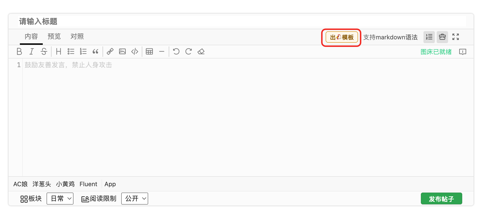
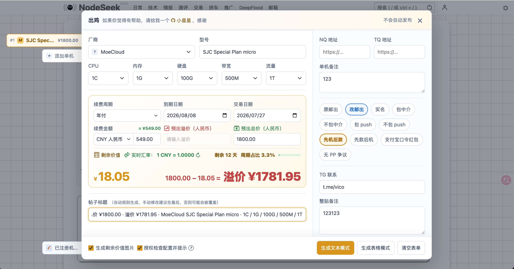
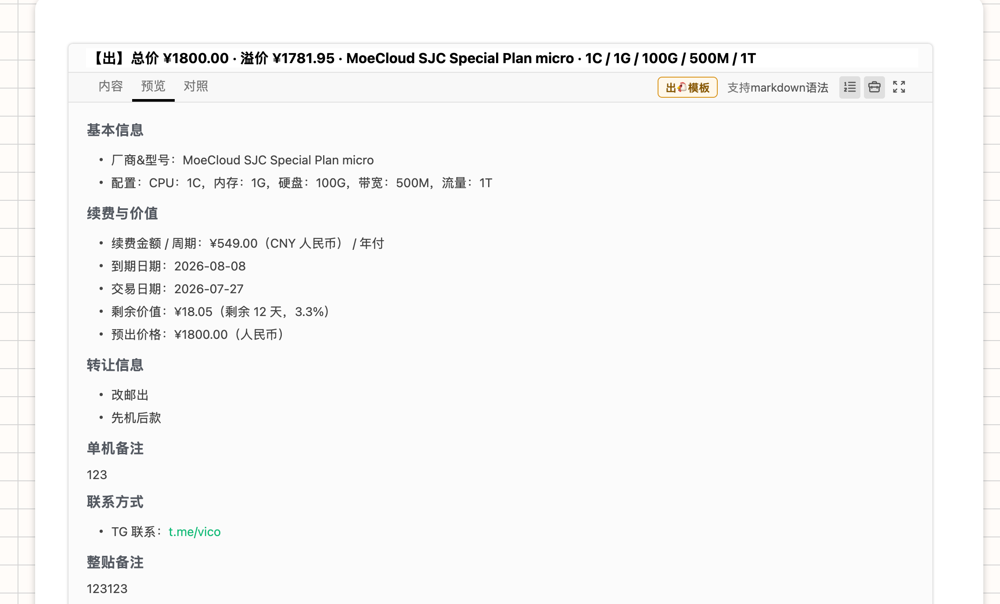
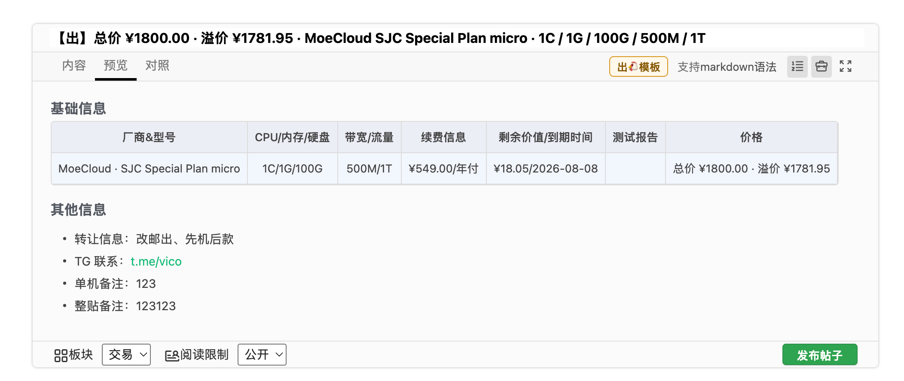
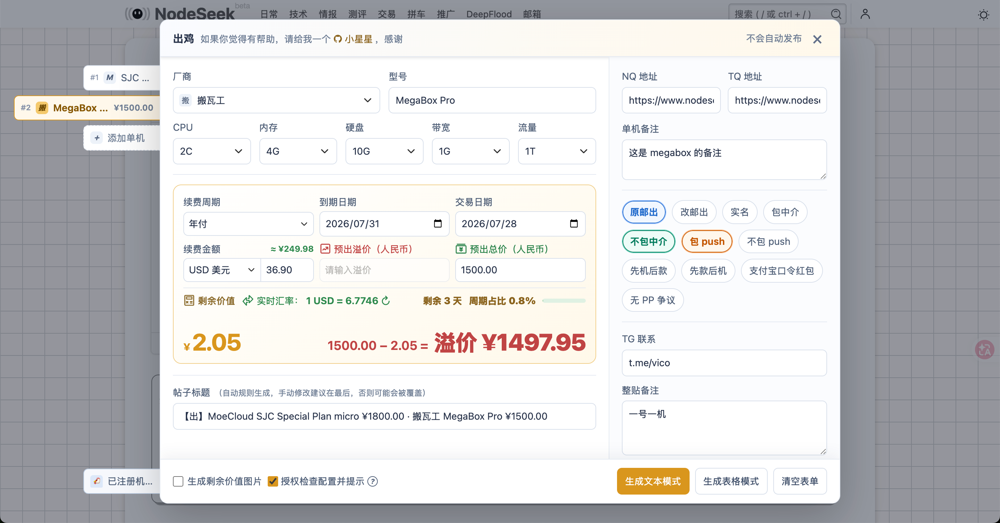
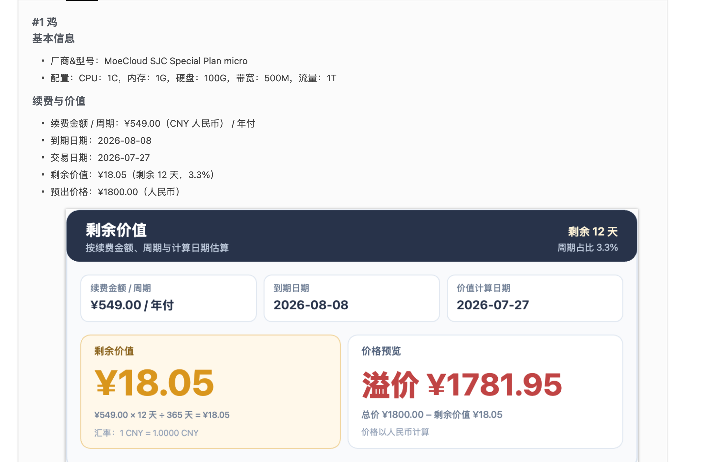
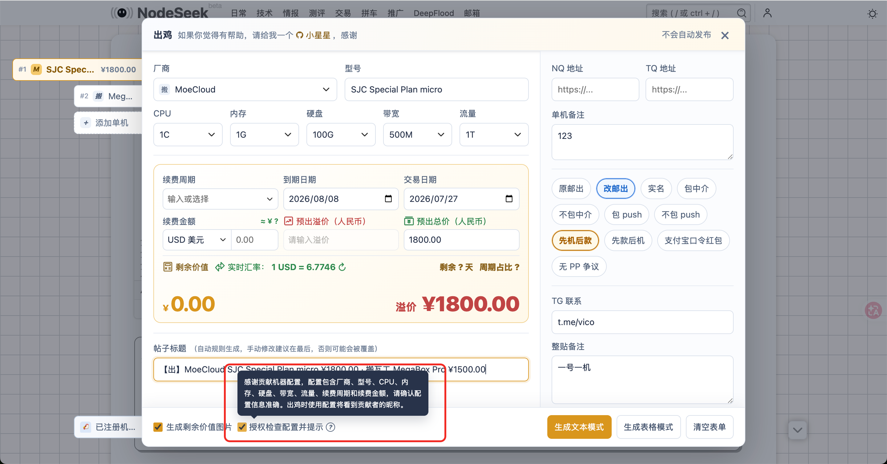
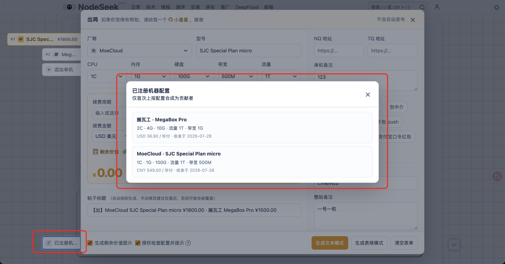
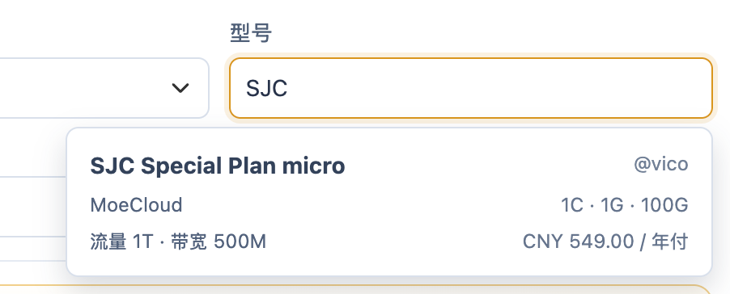

# NodeSeek Issue Templates

为 NodeSeek 交易帖准备的 Tampermonkey 脚本。通过表单快速生成单机或多机交易帖的标题与 Markdown，减少重复填写，让配置信息更清晰、交易内容更易读。

## 安装

在 Tampermonkey 中直接安装：[NodeSeek Issue Templates.min.user.js](https://github.com/ruoqianfengshao/nodeseek-issue-template/releases/latest/download/NodeSeek.Issue.Templates.min.user.js)。

脚本覆盖 NodeSeek 全站，但只会在包含帖子标题和 Markdown 编辑器的新帖页或编辑帖页注入“出🐔模板”入口，不影响普通浏览。

## 使用界面

点击发帖页面的“出🐔模板”入口，填写机器配置、交易信息和常用标签后，即可生成可直接发布的内容。





支持文本和表格两种 Markdown 格式，也可以在一篇帖子中整理多台机器。

| 文本格式 | 表格格式 |
| --- | --- |
|  |  |



可选导出剩余价值卡片，帮助买家快速了解剩余价值。



## 功能

- 支持厂商、型号、CPU、内存、硬盘、带宽、流量等配置的选择、匹配和自由新增
- 支持单机、多机书签编辑与统一标题生成
- 支持剩余价值计算、续费金额人民币换算和实时汇率；可选择是否导出价值卡片
- 支持预出总价与溢价二选一校验及价格预览
- 支持填写 NodeSeek / TQ 地址，以及常用标签快捷选择
- TG 地址本地缓存：填写一次后可自动回填
- 支持文本和表格两种 Markdown 导出格式
- 支持新帖与编辑已有帖子；编辑时会自动解析当前 Markdown，还原单机或多机表单

## 配置共建

机器型号和市场变化很快，因此脚本提供了可选的配置共建机制。

启用“提交时检查机器配置”后，生成帖子时会检查当前机器配置；数据库中没有的配置会被登记为新的可复用配置。若不希望提交配置，关闭该选项即可，脚本不会检查或上报机器信息。



已登记的配置会记录贡献者，方便查看自己贡献过的机器配置。



填写型号时，可根据输入内容搜索已登记配置；选中后会自动回填厂商、型号、CPU、内存、硬盘、带宽、流量、续费周期和续费金额，并展示贡献者昵称。



## 后续规划

- 增加更多个人配置，减少重复填写
- 增加收机帖模板能力
- 在完成官方认证后，探索已上报机器的删除与管理能力
- 支持机器以外的交易内容

## 开发

依赖：Node.js 20 或更高版本。

```sh
node tools/build.js build
node --check 'NodeSeek Issue Templates.user.js'
node --check 'NodeSeek Issue Templates.min.user.js'
git diff --check
```

源码位于 `src/`，本地厂商图标在 `assets/vendors/`。根目录的 `NodeSeek Issue Templates.user.js` 与 `NodeSeek Issue Templates.min.user.js` 分别是可读版和压缩版构建产物，不直接编辑；修改源码后执行构建命令。

GitHub Actions 会在推送和 Pull Request 时重新构建，并验证构建产物没有未提交差异。推送 `v*` 标签会自动创建 GitHub Release 并附带两份脚本。

## 共享配置服务

服务端位于 [`worker/`](worker/README.md)，部署到 Cloudflare Workers + D1。部署后将 Worker 地址填入 [`src/config.js`](src/config.js) 的 `MACHINE_CATALOG_API_URL`，再构建并发布 userscript。
